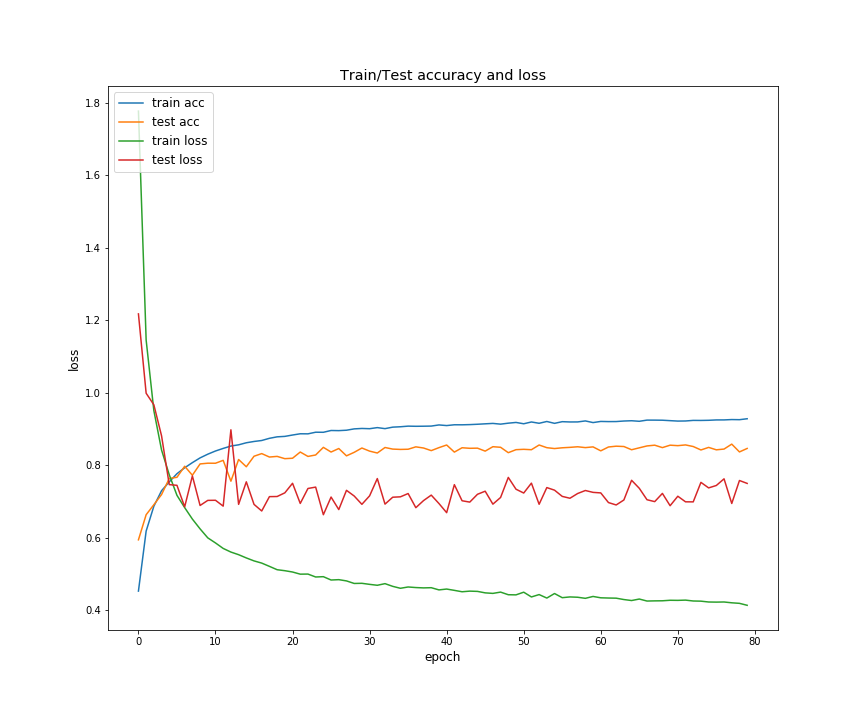
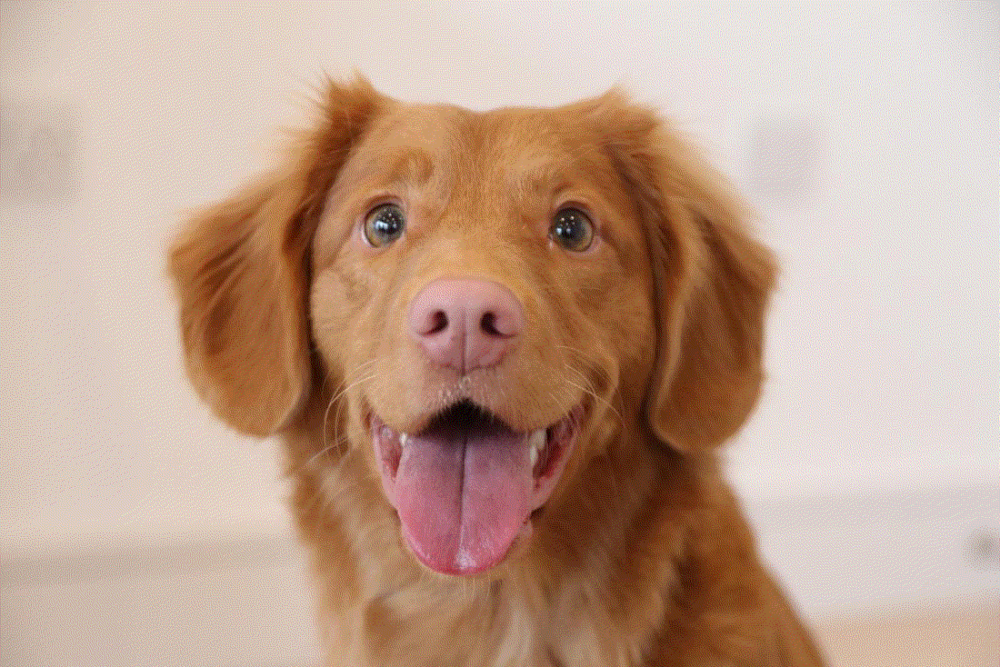

# Style-Transfer
Style Transfer project based on [Gatys et al. 2015](https://arxiv.org/abs/1508.06576) paper, using [Keras](https://keras.io/).  
The project consists of two scripts. 
One to train a network and one which makes use of a pretrained network, in order to transfer style.

## Usage
#### Train network
```
usage: train_network.py [-h] [-sp START_POINT] [-ow] [-oc] [-oh]
                        [-wf WEIGHTS_FILEPATH] [-hf HISTORY_FILEPATH]
                        [-cf CHECKPOINT_FILEPATH]
                        [-o {adam,rmsprop,sgd,adagrad,adadelta,adamax}]
                        [-lr LEARNING_RATE] [-cn CLIP_NORM] [-cv CLIP_VALUE]
                        [-b1 BETA1] [-b2 BETA2] [-rho RHO] [-m MOMENTUM]
                        [-d DECAY] [-bs BATCH_SIZE]
                        [-ebs EVALUATION_BATCH_SIZE] [-e EPOCHS]
                        [-v VERBOSITY]

Training the custom CNN network, to be used for style transferring.

optional arguments:
  -h, --help            show this help message and exit
  -sp START_POINT, --start_point START_POINT
                        Filepath containing existing weights to initialize the
                        model.
  -ow, --omit_weights   Whether the weights should not be saved (default
                        False).
  -oc, --omit_checkpoint
                        Whether the best weights checkpoint should not be
                        saved (default False).
  -oh, --omit_history   Whether the training history should not be saved
                        (default False).
  -wf WEIGHTS_FILEPATH, --weights_filepath WEIGHTS_FILEPATH
                        Path to store the trained network's weights (default
                        out/network_weights.h5). Ignored if --omit_weights has
                        been chosen
  -hf HISTORY_FILEPATH, --history_filepath HISTORY_FILEPATH
                        Path to store the trained network's history (default
                        out/train_history.pickle). Ignored if --omit_history
                        has been chosen
  -cf CHECKPOINT_FILEPATH, --checkpoint_filepath CHECKPOINT_FILEPATH
                        Path to store the trained network's best
                        checkpoint(default out/checkpoint.h5). Ignored if
                        --omit_checkpoint has been chosen
  -o {adam,rmsprop,sgd,adagrad,adadelta,adamax}, --optimizer {adam,rmsprop,sgd,adagrad,adadelta,adamax}
                        The optimizer to be used. (default rmsprop).
  -lr LEARNING_RATE, --learning_rate LEARNING_RATE
                        The learning rate for the optimizer (default 0.001).
  -cn CLIP_NORM, --clip_norm CLIP_NORM
                        The clip norm for the optimizer (default 1).
  -cv CLIP_VALUE, --clip_value CLIP_VALUE
                        The clip value for the optimizer (default 0.5).
  -b1 BETA1, --beta1 BETA1
                        The beta 1 for the optimizer (default 0.9).
  -b2 BETA2, --beta2 BETA2
                        The beta 2 for the optimizer (default 0.999).
  -rho RHO              The rho for the optimizer (default 0.9).
  -m MOMENTUM, --momentum MOMENTUM
                        The momentum for the optimizer (default 0.0).
  -d DECAY, --decay DECAY
                        The decay for the optimizer (default 1e-06).
  -bs BATCH_SIZE, --batch_size BATCH_SIZE
                        The batch size for the optimization (default 64).
  -ebs EVALUATION_BATCH_SIZE, --evaluation_batch_size EVALUATION_BATCH_SIZE
                        The batch size for the evaluation (default 128).
  -e EPOCHS, --epochs EPOCHS
                        The number of epochs to train the network (default
                        125).
  -v VERBOSITY, --verbosity VERBOSITY
                        The verbosity for the optimization procedure (default
                        1).

Note: The hyperparameters will be ignored if the chosen optimizer does not use
them.
```

#### Style Transfer
```
usage: style_transfer.py [-h] [-i ITER] [-g] [-f FRAMES] [-d DURATION]
                         [-l LOOP] [-cw CONTENT_WEIGHT] [-sw STYLE_WEIGHT]
                         [-tvw TV_WEIGHT] [-n {vgg,custom}] [-p PATH]
                         content style result

Style transfer using VGG19 feature layers and L-BFGS optimizer.

positional arguments:
  content               Path to the content image.
  style                 Path to the style image.
  result                Prefix for the saved image results. Please omit the
                        extension, which is chosen automatically (.png).
                        Creates the path to the file if it does not exist.

optional arguments:
  -h, --help            show this help message and exit
  -i ITER, --iter ITER  Number of iterations for the optimizer (default 1000).
                        If --gif is passed, this is the number of iterations
                        for each frame.
  -g, --gif             Whether a gif of the procedure should be created
                        (default False).
  -f FRAMES, --frames FRAMES
                        Number of the gif frames (default 10). Ignored if
                        --gif is not passed.
  -d DURATION, --duration DURATION
                        Duration of the gif in milliseconds (default 3000).
                        Ignored if --gif is not passed.
  -l LOOP, --loop LOOP  Number of times the gif should loop (default 0). For
                        infinite loop, the number 0 should be passed.
  -cw CONTENT_WEIGHT, --content_weight CONTENT_WEIGHT
                        Content weight (default 50).
  -sw STYLE_WEIGHT, --style_weight STYLE_WEIGHT
                        Style weight (default 100).
  -tvw TV_WEIGHT, --tv_weight TV_WEIGHT
                        Total Variation weight (default 100).
  -n {vgg,custom}, --network {vgg,custom}
                        The network to be used. (default vgg).
  -p PATH, --path PATH  The network's weights path. (default ). Use this
                        parameter, if you have the network's weights saved
                        locally, so that you do not have to wait for the model
                        to download. It should be the wights of the network
                        that was specified with the '--network' parameter.
                        WARNING: If you choose the custom network, the weights
                        have to be passed.If you choose the VGG network, this
                        parameter may be ignored and the weights will be
                        automatically downloaded.

Note: The result image is going to have the same dimensions with the content
image.
```

## Results
#### Training


#### No TV Loss
The current implementation uses a Total Variation Loss. 
In this example I have compared the results with and without TV Loss 
and as we can see, they are better without, in this case. 
For that reason, I have used very small TV weights in order to produce the final results below.


#### Optimisation Procedure Visualisation


#### Style transfer

